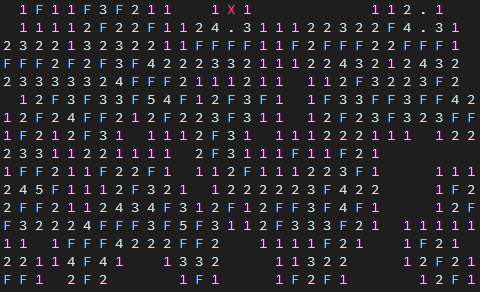

# Minesweeper solver in Rust

Minesweeper challenge in Python, solved with Rust.

The solver tries to uncover as much cells without guessing. But when it gets stuck it will calculate an approximation of the mine probability for the remaining unknown cells. Then it makes a guess, and uncovers the cell with the lowest probability to contain a mine. So the solver will sometimes accidentally uncover a mine, and fail.

The current success rate for solving the whole field is:

| Mode         | Success rate |
|--------------|--------------|
| Beginner     |          93% |
| Intermediate |          73% |
| Expert       |          31% |

The success rate may be further improved by making the mine probability approximation better. Or maybe there is a clever algorithm to determine the exact probabilities.

A Rust re-implementation of the challenge has been been written, to eliminates the Python FFI call overhead. But no other real performance optimization have been done.
